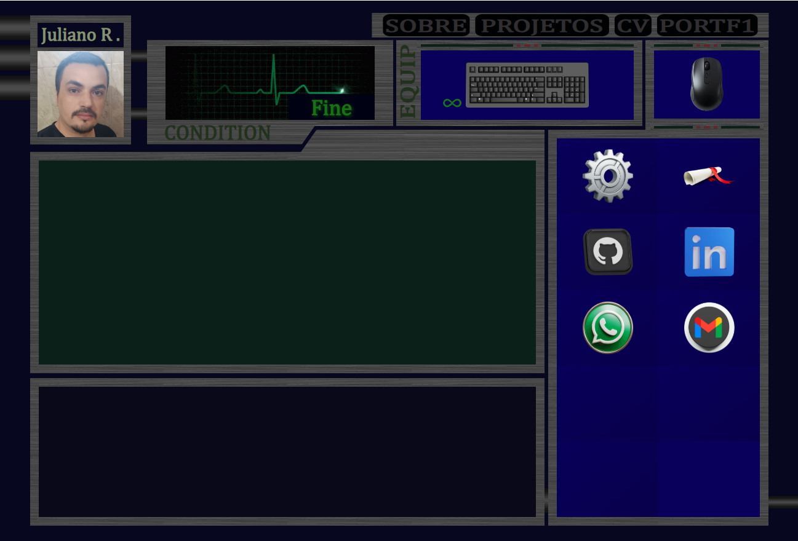

# Portfólio RE2

Este é um portfólio pessoal criado por **Juliano Reis**. O projeto apresenta informações sobre mim, meus projetos, habilidades, certificados e formas de contato, tudo com visual inspirado em Resident Evil 2 e animações dinâmicas.

## Demonstração



## Funcionalidades

- **Menu interativo**: navegação entre Sobre, Projetos, CV, Portfólio Principal.
- **Skills, GitHub e LinkedIn**: menus modais animados com informações e links.
- **Contato rápido**: WhatsApp e Gmail exibem informações ao clicar.
- **Certificados**: lista de certificados acessíveis por link.
- **Carrossel de projetos**: navegação visual por projetos com links.
- **Animação de página (Sobre)**: transição suave entre parágrafos usando setas.
- **Sons e efeitos**: interatividade com efeitos sonoros e visuais em tempo real.
- **Música de fundo**: trilha sonora de Resident Evil 2 em loop.

## Tecnologias Utilizadas

- **HTML5**
- **CSS3**
- **JavaScript**
- [TypeIt](https://typeitjs.com/) (animação de texto)

## Estrutura de Arquivos

```
/
├── index.html            # Página principal
├── sobre.html            # Conteúdo da seção Sobre, carregada dinamicamente
├── certificados.html     # Conteúdo dos Certificados, carregada dinamicamente
├── style.css             # Estilos principais
├── script.js             # Script principal (eventos, animações, navegação dinâmica)
├── audio/                # Sons de fundo e efeitos
├── img/                  # Imagens do perfil, skills, fundo etc.
├── font/                 # Fonte Cambria personalizada
```

## Como rodar

1. **Clone o repositório:**
   ```bash
   git clone https://github.com/JulianoVReis/portfolio-re2.git
   ```
2. **Abra o arquivo `index.html` no seu navegador.**
3. Caso rode localmente, use um servidor HTTP local para evitar problemas com fetch de páginas dinâmicas:
   ```bash
   # Com Python 3
   python -m http.server
   # Ou com Node.js (http-server)
   npx http-server .
   ```

## Observações

- As páginas `sobre.html` e `certificados.html` são carregadas dinamicamente via JavaScript.
- O carrossel dos projetos pode ser expandido facilmente editando o array no `script.js`.
- Os efeitos sonoros funcionam melhor em navegadores modernos.
- O design é responsivo apenas para desktop (ajuste para mobile pode ser necessário).

## Créditos

- **Desenvolvimento:** Juliano Reis
- **Inspiração visual e sonora:** Resident Evil 2

## Licença

Este projeto é um portfólio pessoal, uso livre para fins de consulta e aprendizado. Para reutilização de partes específicas, consulte o autor.

---

**Dúvidas, sugestões ou contato:**  
[LinkedIn](https://www.linkedin.com/in/juliano-reis-290b0b324/)  
julianovreis@gmail.com
